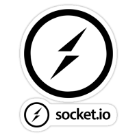
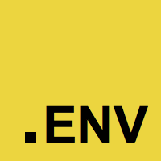

# Tercera Entrega Proyecto Final

## Facundo Creus

### 🏠 [Homepage](https://github.com/fakush/after-3ra-entrega/02-EjemploApp)

## Stack

<h5 align="center">App en Node JS. Código en Typescript. Servidor Express. Motor de Plantillas Handlebars. WebSocket Socket.IO</h5>
<h5 align="center">Persistencia: Memoria - File System / Motores de Bases de Datos: - MongoDB</h5>
<h5 align="center">Librerías Auxiliares: Cookie Parser - DotEnv - ES Lint - Prettier - Jest - Faker - Normalizr - Knex - Moment.js - Mongoose - UUID - Connect-Mongo - Etc.</h5>
<div align="center" style="background-color:Grey">
    <table>
        <tr>
            <td></td>
            <td></td>
            <td></td>
            <td></td>
            <td></td>
            <td></td>
        </tr>
        <tr>
            <td></td>
            <td></td>
            <td></td>
            <td></td>
            <td></td>
            <td></td>
        </tr>
        <tr>
            <td></td>
            <td></td>
            <td></td>
            <td></td>
            <td></td>
            <td></td>
        </tr>
        <tr>
            <td></td>
            <td></td>
            <td></td>
            <td></td>
            <td></td>
            <td></td>
        </tr>
    </table>
</div>
<BR />
<br />

## Endpoints Documentation

```http
/api-docs
```

---

## Prerequisites

- node >=14.0.0
- npm >=6.0.0

## Install

```sh
npm install
```

## Build

```sh
npm run build
```

## Usage

```sh
npm run start
```

## Run as dev

```sh
npm run dev
```
